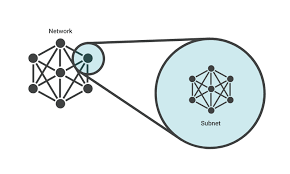

# VPC (Virtual Private Cloud)

## Creating a Two-Tier VPC With Mongodb, App and Bastien servers

- Firstly you must create a vpc and choose an appropriate IP address.
- Next Create an internet gateway. Afterwards attach the internet gateway to the vpc to give vpc access to the internet.
- We then move on to create the private subnet for the database server mongodb, the public server for the app as well as the bastian server. 

### VPC

- Create a VPC with any name, and a description along with a private IP Address.
- In this case the name is `eng89_shervin_vpc`.
- Description: `shervins vpc for node application`
- Ipv4: `10.209.0.0/16`

### Internet Gateway

- Internet gateways give the vpc a route into the internet. This should bre created next.
-  Create an IG and once created, attach it to the VPC.

### Subnets

- Subnets are essentially networks inside networks. They make the network more efficient and allows us to restrict/isolate systems.
- We now must create the subnets within the VPC for the Bastion, MongoDB and the App.
- The Public Subnet should be set first by giving a name, description, IPv4 and a vpc association. For the public the name chosen is `eng89_public_shervin` and the Ip `10.109.1.0/24`
- The private IP is name `eng89_private_shervin` with an IP of `10.209.2.0/24`.
- The private IP is name `eng89_bastion_shervin` with an IP of `10.209.3.0/24`.

### Route Table

- Create a route table and attach it to your VPC.
- Swiftly go back to the subnets. Select on your public and bastion servers `route table` and add them in.

### Network ACLs

- Network ACLs are stateful firewalls and monitor all inbound and outbound connections. For each ACL once created we must associate them with a subnet.

**eng89 public_server_nacl**

Inbound Rules:

- Rule: 100   Type: HTTP   Source: 0.0.0.0/0  ALLOW
- Rule: 110   Type: SHH   Source: `personal IP address`  ALLOW
- Rule: 120   Type: Custom TCP  Port: 1024 - 65534  Source: 0.0.0.0/0  ALLOW

Outbound Rules:

- Rule: 100   Type: HTTP   Source: 0.0.0.0/0  ALLOW
- Rule: 110   Type: Custom TCP  Port 27017 Source: `Mongodb address e.g 10.209.2.0/24`  ALLOW
- Rule: 120   Type: Custom TCP  Port: 1024 - 65534  Source: 0.0.0.0/0  ALLOW

**eng89 private _server_nacl**

Inbound Rules:

- Rule: 100   Type: Custom TCP   port: 27017   Source: 10.109.1.0/24  ALLOW
- Rule: 110   Type: SHH   Source: 10.109.3.0/24  ALLOW
- Rule: 120   Type: Custom TCP  Port: 1024 - 65534  Source: 0.0.0.0/0  ALLOW

Outbound Rules:

- Rule: 100   Type: HTTP   Source: 0.0.0.0/0  ALLOW
- Rule: 120   Type: Custom TCP  Port: 1024 - 65534  Source: 10.109.3.0/24  ALLOW
- Rule: 130   Type: Custom TCP  Port: 1024 - 65534  Source: 10.109.1.0/24  ALLOW

**eng89 Bastion_server_nacl**

Inbound Rules:

- Rule: 110   Type: SHH   Source: `personal Ip address`  ALLOW
- Rule: 120   Type: Custom TCP  Port: 1024 - 65534  Source: 10.209.2.0/24  ALLOW

Outbound Rules:

- Rule: 100   Type: SSH   Source: 10.109.2.0/24  ALLOW
- Rule: 120   Type: Custom TCP  Port: 1024 - 65534  Source: 0.0.0.0/0  ALLOW

### Security Groups

- A stateless firewall to further protect data.

**eng89_public_shervin_sg**

Inbound Rules:

- Type: HTTP   source: 0.0.0.0/0
- Custom TCP  port: 3000 Source: 0.0.0.0/24
- SSH          Source: `Personal IP`

Outbound Rules:

- All traffic

**eng89_private_shervin_sg**

Inbound Rules:

- Custom TCP   port: 27017 Source: `security for app`
- SSH          Source: `select bastian security group`

Outbound Rules:

- All traffic

**eng89_Bastian_shervin_sg**

Inbound Rules:

- SSH    Source: `select personal IP address`

Outbound Rules:

- All traffic

### EC2

- Next spin up `AMI's` for the app and mongodb servers.  
- Run mongodb, also make sure to connect 

